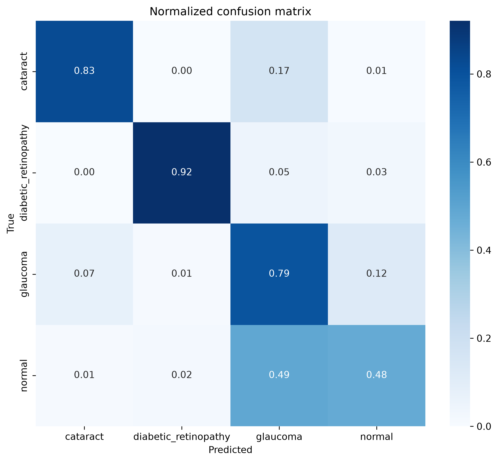
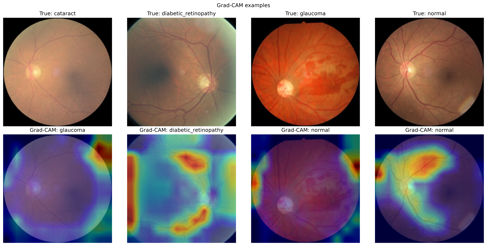

# Eye Disease Classification with an Enhanced Custom CNN

An end-to-end retinal image classification project for cataract, diabetic
retinopathy, glaucoma, and normal images. The model remains a custom CNN while
adding residual learning, squeeze-and-excitation attention, batch
normalization, global average pooling, regularization, partially
patient-grouped splitting where filename-derived patient IDs exist,
explainability, and reproducible evaluation.

> This is an academic prototype and is not intended or validated for clinical
> diagnosis.

## Enhanced-model held-out results

The saved best checkpoint was evaluated on the locked test split of 631 images.
The split is partially patient-grouped: filename-derived grouping covered 65.8%
of retained images, including all diabetic-retinopathy and normal images and
about 30% of the glaucoma and cataract images. The remaining images were split
as individuals. These numbers were generated by the included pipeline and are
stored in
`docs/results/evaluation_metrics.json`.

| Metric | Computed value |
|---|---:|
| Accuracy | 75.4% |
| Balanced accuracy | 75.5% |
| Macro precision | 78.8% |
| Macro recall | 75.5% |
| Macro F1 | 75.5% |
| Weighted F1 | 75.7% |
| Correct predictions | 476 |
| Incorrect predictions | 155 |





## Baseline comparison on the same test split

The baseline is a reproduced retraining of the original architecture from
`Untitled2.ipynb`, not an evaluation of the original weights; the historical
`eye_model.h5` file is unavailable. The reproduction uses the notebook's three
convolutional layers (32/64/128 filters), Flatten, Dense-128 classifier,
224 x 224 input, Adam, batch size 8, 10 epochs, 50 training steps per epoch,
and 10 validation steps. A fixed seed of 42 was added for reproducibility. Both
models below were evaluated on the exact same 631-image test assignment in
`runs/enhanced_cnn/dataset_manifest.csv`.

| Test metric | Reproduced baseline CNN | Enhanced CNN |
|---|---:|---:|
| Accuracy | 64.2% | 75.4% |
| Macro F1 | 59.8% | 75.5% |
| Cataract F1 | 50.8% | 86.5% |
| Diabetic retinopathy F1 | 97.6% | 94.4% |
| Glaucoma F1 | 29.6% | 62.5% |
| Normal F1 | 61.3% | 58.8% |

The reproducible baseline evaluator is `evaluate_baseline_cnn.py`, and its
computed results are stored in `docs/results/baseline_metrics.json`. The values
above are newly computed comparison results, not recovered results from the
missing historical model file.

## Patient grouping

Patient IDs were inferred only when a filename stem matched
`^(.+?)_(left|right)$` (case-insensitive), for example `10003_left.jpeg` and
`10003_right.jpeg`. The part before `_left` or `_right` was stripped,
lowercased, and used as the patient key, keeping all matched images with that
key in one split.

- 2,772 of 4,213 retained images matched the pattern: 65.8%.
- Those images contained 1,539 unique filename-derived patient IDs; 1,201 IDs
  had at least two retained images and 338 IDs had one retained image.
- The matched images comprised all 1,098 diabetic-retinopathy images, all 1,074
  normal images, 296 cataract images, and 304 glaucoma images. This is about
  30% of the retained cataract and glaucoma images.
- The other 1,441 images (34.2%) did not match the pattern and
  were treated as individual images. Their unmatched filename stems were
  unique in this dataset.

The archive places files directly under the four class directories and does
not include a source-dataset field or source-specific subdirectories, so an
upstream source dataset cannot be established from the supplied files. The
only basis for grouping was the `_left`/`_right` filename pattern. Therefore,
the whole dataset is not described as patient-grouped.

## Data quality

- 4,217 valid images were found in the supplied archive; no corrupt images were
  detected.
- SHA-256 content hashing found two exact-duplicate content groups containing
  four image files in total. There were no same-label duplicate groups.
- `1415_right.jpg` appeared once under `cataract` and once under `glaucoma`
  with identical content.
- `625_left.jpg` appeared once under `cataract` and once under `glaucoma`
  with identical content.
- Because each duplicate pair had conflicting labels, all four files were
  excluded; no label was selected and neither copy from either pair was kept.
- 4,213 images remained after this duplicate handling.
- Exact duplicate content and matched patient groups cannot cross dataset
  splits.
- Final split: 2,951 train, 631 validation, and 631 test images.

The machine-readable audit is stored in
`docs/results/data_quality_audit.json`, and the excluded records are stored in
`docs/results/conflicting_duplicate_labels_excluded.csv`.

## Limitations

- The split is only partially patient-grouped. Grouping covered 65.8% of
  retained images; images without a filename-derived patient ID were treated as
  individuals.
- Diabetic-retinopathy F1 is unusually high even for the reproduced baseline
  (97.6%; enhanced model: 94.4%). One possible explanation is that these images
  come from a distinct source, allowing the models to learn source
  characteristics rather than disease features. This possibility has not been
  verified because the supplied archive does not include source provenance.
- This academic prototype has not been validated for clinical diagnosis.

## Model

- Custom residual squeeze-and-excitation CNN
- Input: 192 × 192 RGB
- Parameters: 931,004
- Best checkpoint: epoch 21, selected by validation loss
- Training stopped automatically after epoch 28
- Saved model size: 11,437,821 bytes
- Model SHA-256: `97CDA9D242A8DE288F62530EE448EBBF974B8AC33F9F3CA98C7E941D5B5673F2`

## Generated evidence

The repository includes:

- Raw and normalized confusion matrices
- Per-class precision, recall, F1, ROC-AUC, and PR-AUC
- Training and validation curves
- Class and confidence distributions
- Correct-versus-incorrect counts
- Misclassified image examples
- Grad-CAM explanations
- Measured inference timing and model size
- A machine-readable class mapping and model summary

See [MODEL_CARD.md](MODEL_CARD.md) for complete per-class results and
limitations. See [RUNNING.md](RUNNING.md) for reproducible commands.

## Repository structure

```text
.
├── train_eye_cnn.py
├── requirements.txt
├── MODEL_CARD.md
├── RUNNING.md
├── Untitled2.ipynb
├── models/
│   ├── best_eye_disease_cnn.keras
│   ├── class_names.json
│   └── model_summary.txt
└── docs/results/
    ├── evaluation_metrics.json
    ├── confusion_matrix_normalized.png
    ├── gradcam_examples.png
    └── ...
```
